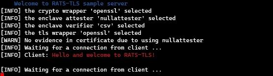
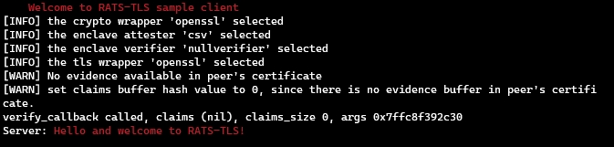

# 目录

- [安装编译依赖的软件包](#安装编译依赖的软件包)
  - [CentOS系统上安装](#CentOS系统上安装)
  - [Ubuntu系统上安装](#Ubuntu系统上安装)
- [编译](#编译)
  - [下载源码](#下载源码)
  - [编译和安装](#编译和安装)
  - [注意事项](#注意事项)
- [运行示例](#运行示例)
  - [运行服务端](#运行服务端)
  - [运行客户端](#运行客户端)
- [选项说明](#选项说明)
  - [认证CSV虚拟机实例](#认证CSV虚拟机实例)
    - [在非CSV虚拟机中运行服务端](#在非CSV虚拟机中运行服务端)
    - [在CSV虚拟机中运行客户端](#在CSV虚拟机中运行客户端)
  - [2个CSV虚拟机实例互认证](#2个CSV虚拟机实例互认证)
    - [在CSV虚拟机1中运行服务端](#在CSV虚拟机1中运行服务端)
    - [在CSV虚拟机2中运行客户端](#在CSV虚拟机2中运行客户端)

---

# 安装编译依赖的软件包

编译rats-tls之前需要安装如下依赖包：
- git
- make
- autoconf
- libtool
- gcc
- g++
- openssl-devel/libssl-dev
- libcbor-devel/libcbor-dev
- cargo
- SGX DCAP软件包（rats-tls在编译时会涉及到相关源码，因此需要安装SGX DCAP相关软件包）
  - libsgx-dcap-quote-verify-devel/libsgx-dcap-quote-verify-dev
  - libsgx-dcap-ql-devel/libsgx-dcap-ql-dev
  - libsgx-uae-service

## CentOS系统上安装

1. 安装官方yum源的软件包

```shell
sudo yum install -y epel-release yum-utils && \
sudo yum install -y \
	cmake \
	make \
	git \
	autoconf \
	libtool \
	gcc \
	gcc-c++ \
	openssl-devel \
	libcbor-devel \
	cargo \
	curl-devel

```

2. 安装SGX DCAP软件包

具体的安装方法可以参考 [链接](https://download.01.org/intel-sgx/sgx-linux/2.18/docs/Intel_SGX_SW_Installation_Guide_for_Linux.pdf)，这里以针对CentOS 8为例进行安装说明。

```shell
sudo mkdir /opt/intel
cd /opt/intel/
sudo wget https://download.01.org/intel-sgx/latest/linux-latest/distro/centos8.3-server/sgx_rpm_local_repo.tgz
sudo tar -xzf sgx_rpm_local_repo.tgz
sudo yum-config-manager --add-repo file:/opt/intel/sgx_rpm_local_repo/
sudo yum install -y --nogpgcheck \
	libsgx-dcap-quote-verify-devel \
	libsgx-dcap-ql-devel \
	libsgx-uae-service
```

## Ubuntu系统上安装

Ubuntu系统上依赖包和CentOS系统上安装构成类似，只是安装工具和软件包名称有所区别。

1. 安装官方apt源的软件包

**TODO**。

2. 安装SGX DCAP软件包

**TODO**。

# 编译

## 下载源码

```shell
mkdir -p "$WORKSPACE"
cd "$WORKSPACE"
git clone https://github.com/inclavare-containers/rats-tls
```

## 编译和安装

```shell
cd rats-tls
cmake -DBUILD_SAMPLES=on -H. -Bbuild
sudo make -C build install
```

`{rats-tls-server,rats-tls-client}`将会被安装到`/usr/share/rats-tls/samples/{rats-tls-server,rats-tls-client}`，所有attester和verifier都会被安装到`/usr/local/lib/rats-tls`。

## 注意事项

rats-tls在编译包含CSV的attester时也会编译SEV的attester，但是SEV attester部分源码依赖于第三方rust代码，这里容易导致编译失败，为了避免SEV attester编译导致的编译失败，用户可以对rats-tls进行修改，如下：

```c
diff --git a/src/attesters/CMakeLists.txt b/src/attesters/CMakeLists.txt
index 103c8d0..4d61910 100644
--- a/src/attesters/CMakeLists.txt
+++ b/src/attesters/CMakeLists.txt
@@ -1,7 +1,7 @@
 add_subdirectory(nullattester)

 if(HOST)
-    add_subdirectory(sev)
+       #add_subdirectory(sev)
     if(EXISTS "/usr/include/linux/sev-guest.h")
         add_subdirectory(sev-snp)
     endif()
```

# 运行示例

服务端一般为认证方，用于对客户端的认证报告进行验证，验证通过后，服务端才允许进行下一步的通信。这里的示例服务端和客户端运行在同一主机上，只是作为运行服务端和客户端的最简单示例。

## 运行服务端

```shell
cd /usr/share/rats-tls/samples
./rats-tls-server
```

## 运行客户端

```shell
cd /usr/share/rats-tls/samples
./rats-tls-client
```

# 选项说明

rats-tls-server提供了如下选项：

```shell
OPTIONS:
   --attester/-a value   set the type of quote attester
   --verifier/-v value   set the type of quote verifier
   --tls/-t value        set the type of tls wrapper
   --crypto/-c value     set the type of crypto wrapper
   --mutual/-m           set to enable mutual attestation
   --log-level/-l        set the log level
   --ip/-i               set the listening ip address
   --port/-p             set the listening tcp port
   --product-enclave/-P  set to enable product enclave
   --verdictd/-E         set to connect verdictd based on EAA protocol
```

本文档为了说明rats-tls如何使用CSV attester和CSV verifier，需要了解上述选项中的部分内容，解释如下：

- --attester/-a value
  - 指定选择value类型的attester，例如`-a csv`表示在CSV虚拟机实例中生成并提供认证报告。
- --verifier/-v value
  - 指定选择value类型的verifier，例如`-v csv`表示需要验证的认证报告来自于CSV虚拟机实例。
- --mutual/-m
  - 指定互相认证，服务端不仅要验证客户端的认证报告，还需要提供认证报告给客户端，以便客户端验证服务端；同样的，客户端不仅要提供认证报告给服务端，同时也要验证服务端发来的认证报告。
- --log-level/-l value
  - 指定调试的打印级别，共有6个级别：`off, fatal, error, warn, info, debug`，默认的打印级别时`error`。此外，需要注意的是：在rats-tls的启动初期，默认是静默输出的，为了让初期的调试信息可以打印出来，需要设置环境变量`RATS_TLS_GLOBAL_LOG_LEVEL=<log_level>`，其中`<log_level>`的值和`-l`参数的值一样。
- --ip/-i
  - 指定服务端绑定的IP地址，默认绑定的IP地址是127.0.0.1。
- --port/-p
  - 指定服务端绑定的网络端口，默认绑定的端口号是1234。

## 认证CSV虚拟机实例

### 在非CSV虚拟机中运行服务端

假设服务端绑定的IP地址和端口为192.168.122.1:1234。

```shell
cd /usr/share/rats-tls/samples
./rats-tls-server -v csv -a nullattester -i 192.168.122.1 -p 1234
```



### 在CSV虚拟机中运行客户端

当使用CSV类型的attester时，需要确保/dev/cpu/0/msr设备文件已经存在，如果不存在，需要加载内核msr模块。由于访问该文件需要root权限，所以需要以root权限客户端程序。

```shell
# sudo modprobe msr
# ls /dev/cpu/0/msr
/dev/cpu/0/msr
```

此外，使用CSV类型的attester时，需要以root权限客户端程序。

```shell
cd /usr/share/rats-tls/samples
sudo ./rats-tls-client -a csv -v nullverifier -i 192.168.122.1 -p 1234
```



## 2个CSV虚拟机实例互认证

### 在CSV虚拟机1中运行服务端

假设服务端绑定的IP地址和端口为192.168.122.1:1234。

```shell
cd /usr/share/rats-tls/samples
sudo ./rats-tls-server -a csv -v csv -i 192.168.122.1 -p 1234
```

### 在CSV虚拟机中2运行客户端

```shell
cd /usr/share/rats-tls/samples
sudo ./rats-tls-client -a csv -v csv -i 192.168.122.1 -p 1234
```